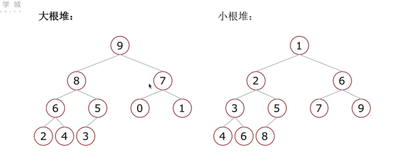
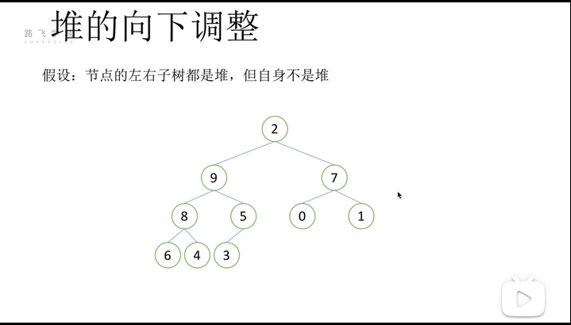
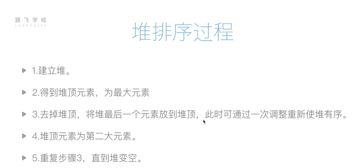
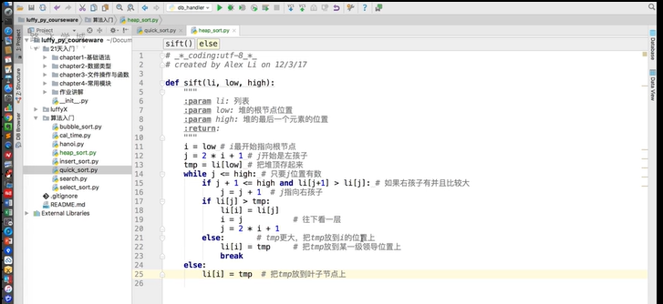
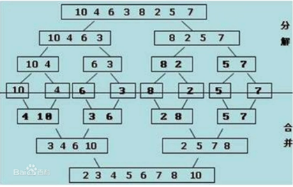
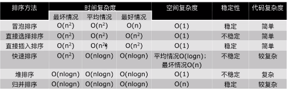

**1.常见排序算法：**
排序low B三人组：冒泡排序 选择排序 插入排序 全部都是o(n^2)
排序牛逼三人组：快速排序nlogn 堆排序 nlogn归并排序nlogn 全部都是o(nlogn)
其他排序：希尔排序 计数排序 基数排序 桶排序

**2.冒泡排序（Bubble Sort）**
列表每两个相邻的数，如果前面的比后面的大，则交换这两个数；（这一行属于是一趟排序，把最大的数换到了最后面，后面的元素称为有序区）
一趟排序完成后，则无序区减少一个数，有序区增加一个数。
代码关键点：趟、无序区范围
（优化：加exchange这一布尔值进行判断）

**3.选择排序（Select sort）**
3.1把整个序列遍历一遍找到一个最小的，把这个最小的放到一个新列表中，再把列表中剩下的元素一直遍历，直到所有元素遍历结束（不够优秀）
3.2一趟排序记录最小的数，放到第一个位置；再一趟排序记录列表无序区最小的数，放到第二个位置
算法关键点：有序区和无序区、无序区最小数的位置

**4.插入排序（Insert sort）**
插牌比喻：初始时手里（有序区）只有一张牌；每次（无序区）摸一张牌，插入到手里已有牌的正确位置(当摸到的牌比手里的牌小，就后移手里的牌一个位置，如果一直小，
就一直后移手里的牌，直到摸到的牌比手里的牌大或者到了最前排的时候 为止就放在手里的牌的后面)。

**5.快速排序（Quick_sort）-俗称左右横跳算法**
5.1 算法思路：取一个元素p（第一个元素），使元素p归位；
p归位的表现：列表被p分成两部分，左边都比p小，右边都比p大；
递归完成排序。
本质上只要完成“归位”算法，再使用递归，就可以完成整个过程。
5.2 时间复杂度：O(nlogn)；解释：每一次partition()函数走的是O(n)，一共是logn层，因此这个过程是O(nlogn)
5.3 最坏情况：每次只分开一个数和n-2个数，因为快速排序每次不是使用partition()函数分成两组吗，但是如果一组只有一个数，另外一组有n-1-1=n-2个数的话，
这种情况就会是最坏情况，时间复杂度是O(n^2)，相当于冒泡排序。为什么一组只有一个数会是O(n^2)呢，因为，这样会有n次partition，每次partition的复杂度
是0(n),所以最后是O(n^2)。比如说是倒序的例子：[9,8,7,6,5,4,3,2,1]

**6.堆排序**
_满二叉树和完全二叉树的概念：_
满二叉树：一个二叉树，如果每一层的结点数都达到最大值，那么这个二叉树就是满二叉树。
完全二叉树：叶节点只能出现在最下层和次下层，并且最下面一层的结点都集中再该层最左边的若干位置的二叉树。
6.1 堆的定义：一种特殊的**完全二叉树结构**,分为大根堆和小根堆。
大根堆：一棵完全二叉树，满足任一节点都比其孩子结点要大（排出来的是增序）
小根堆：一棵完全二叉树，满足任一节点都比其孩子结点要小

6.2 堆的向下调整性质：
当根结点的左右子树都是堆时，但是根节点不满足堆的性质，可以通过*一次向下的调整*来将其变换成一个堆，以大根堆为例：

6.3 堆排序的过程演示（见视频p22-06：00） 
1)构造堆
（包括两个过程：1.向上调整过程为大根堆的过程：由*_完全二叉树最后一个有叶子的结点（n-2/2）_*开始向上调整 
2.待根节点的左右子树都通过向上调整完成成为堆时，再进行一次向下调整）
2)向下调整的过程中挨个出数
注意：完全二叉树最后一个有叶子的结点即最后一个非终端结点，它的下标是n-2/2（根节点从0开始）
**7.归并排序**
python中的排序算法是基于此的。
_归并：_
假设现在的列表分两段有序，如何将其合成为一个有序列表，这个过程称为一次归并。
_使用归并：_
分解：将列表越分越小，直至分成一个元素。（递归）
终止条件：一个元素是有序的（递归终止条件）
合并：将两个有序列表归并，列表越来越大。（归并）
时间复杂度：一次归并过程是O(n)，递归一共有logn层，所以是nlogn
空间复杂度：O(n)，因为merge()的归并过程是开辟了一个新的ltmp列表

Nb三人组小结：
Nb三人组和LowB三人组的时间复杂度、空间复杂度、稳定性分析
排序算法的稳定性
32124
稳定的排序能保持相同数的相对位置不变，如果两个数的值一样，就不交换，因此那些核心代码是一个一个比较、然后交换的代码 是稳定的，如冒泡排序、插入排序、归并排序
